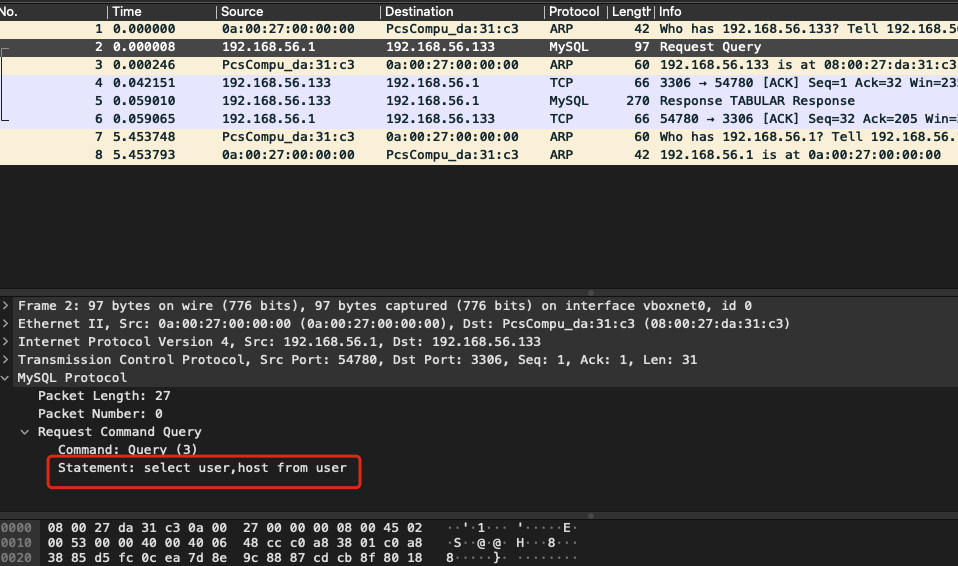

# MySQL 的 SSL 连接以及连接信息查看

在上篇文章中，我们学习过 MySQL 的两种连接方式，回忆一下，使用 -h 会走 TCP 连接，不使用 -h 可以使用另两种方式来走 UnixSocket 连接。我们就接着这个话题再聊点别的，首先要纠正一下之前讲的，-h 不一定全是走 TCP 连接。然后我们顺着这个话题，再看一下 MySQL 中如何指定使用安全连接的问题。在学习这两个问题中，我们还将接触到一个查看当前连接状态的命令。

## 再谈连接方式

上回我们已经讲过有两种连接方式，在讲问题之前，我们先了解一个 MySQL 命令工具，它就是 \s 命令（全称是 status ，你也可以使用 \status 或者 status; 来查看）。

```shell
➜  ~ mysql -hlocalhost -uroot

Welcome to the MySQL monitor.  Commands end with ; or \g.
Your MySQL connection id is 11
Server version: 8.0.17 Homebrew

Copyright (c) 2000, 2019, Oracle and/or its affiliates. All rights reserved.

Oracle is a registered trademark of Oracle Corporation and/or its
affiliates. Other names may be trademarks of their respective
owners.

Type 'help;' or '\h' for help. Type '\c' to clear the current input statement.


mysql> \s
--------------
mysql  Ver 8.0.17 for osx10.14 on x86_64 (Homebrew)

Connection id:		11
Current database:
Current user:		root@localhost
SSL:			Not in use
Current pager:		less
Using outfile:		''
Using delimiter:	;
Server version:		8.0.17 Homebrew
Protocol version:	10
Connection:		Localhost via UNIX socket
Server characterset:	utf8
Db     characterset:	utf8
Client characterset:	utf8mb4
Conn.  characterset:	utf8mb4
UNIX socket:		/tmp/mysql.sock
Uptime:			18 min 55 sec

Threads: 2  Questions: 20  Slow queries: 0  Opens: 113  Flush tables: 3  Open tables: 35  Queries per second avg: 0.017
--------------
```

看出来作用了吗？它可以展示我们当前的连接状态以及服务器的一些系统信息。Current user 和 Current database 就是我们上回学习的 SELECT CURRENT_USER() 和 SELECT DATABASE() 返回的内容。

SSL 的内容我们后面马上就要说，先来看一下 Connection 这个字段的内容。如果你使用的 -h 是 localhost 的话，那么它走的其实也是 UnixSocket 方式。而我们换一下，将连库语句变成 127.0.0.1 会怎么样？

```shell
➜  ~ mysql -h127.0.0.1 -uroot
# .......
# .......
mysql> \s
# .......
# .......
Connection:		127.0.0.1 via TCP/IP
# .......
# .......
```

看出来了吧？换成 IP 或者换成别的 hosts 指向别名，都会变成 TCP 的连接方式。但是只有 localhost 是例外的。我们可以认为，在 MySQL 的内部，对这个特殊的名称做了特别的判断，如果连接的是 localhost ，就认为这个连接客户端和 MySQL 服务器是在同一台主机的，这时就会直接以 UnixSocket 的方式连接，毕竟 UnixSocket 的性能更好。

注意，很多小伙伴有时候用 localhost 连接不上本机的数据库，问题就很有可能出现在 mysql.sock 这个文件的配置可能有误。

如果我们想强制 localhost 也使用 TCP 方式的话，应该怎么弄呢？其实还是上篇文章中提到的那个属性，可以在命令行使用，也可以配置到 my.cnf 中去。

```shell
➜  ~ mysql -hlocalhost -uroot --protocol=tcp
# .......
# .......
Connection:		localhost via TCP/IP
```

## SSL 安全连接

SSL 是啥相信不用我多解释了吧，毕竟现在 HTTPS 都已经成标配了，都是一样的使用 OpenSSL 来进行安全加密传输的。而且在 MySQL 中，对于远程的 TCP 连接，默认就是走这种 SSL 加密传输的。不信上面的 \s 命令输出的内容中就有。

```php
➜  ~ mysql -hlocalhost -uroot --protocol=tcp
# .......
SSL:			Cipher in use is TLS_AES_256_GCM_SHA384
# .......
Connection:		localhost via TCP/IP
```

注意，如果是 UnixSocket 模式下，SSL 这个属性的内容永远是 Not use ，毕竟本机是没有远程传输问题的。

好吧，默认就是启用这种传输连接方式的，那么我们是不是可以关闭它呢？当然可以，我们可以在客户端连接的时候选择不用安全方式连接。

```shell
➜  ~ mysql -h192.168.56.133 -uroot --protocol=tcp --ssl-mode=disabled
# .......
SSL:			Not in use
# .......
```

那么它会不安全在哪里呢？我们直接用 WireShark 来抓包试试。



看到没有，如果是使用了非 SSL 的方式连接，那么我们通过抓包软件是可以抓到执行的 SQL 语句信息。你可以自己再尝试下使用默认的开启 SSL 连接的方式去连接远程 MySQL 服务器，看看还能不能抓到我们执行的 SQL 语句。

客户端可以指定连接的 --ssl-mode ，感觉很不安全呀，其实，我们也可以强制让所有连接都必须使用 SSL 模式，那就是修改一下服务端的 my.cnf 。

```shell
[server]
require_secure_transport=1
```

这时，我们再使用 --ssl-mode=disabled 去连接服务端的话，就会出现如下的错误信息。

```shell
➜  ~ mysql -h192.168.56.133 -uroot -p --ssl-mode=disabled
Enter password:
ERROR 3159 (HY000): Connections using insecure transport are prohibited while --require_secure_transport=ON.
```

既然 SSL 对我们的数据安全有非常重要的作用，而且还默认就是使用 SSL 的方式进行连接的，那么有没有什么特殊的情况是我们不需要去使用 SSL 的呢？有。

SSL 在普通的 TCP 连接的基础上增加了证书相关的验证操作，包括早年 HTTPS 都不是标配的年代，就是因为加了证书验证之后会降低系统的性能。本来我们可以处理的 QPS 是 3000 ，使用了 SSL 之后可能就会变成 2000 （参考文末第二条链接）。这个性能损耗说实话还是挺严重的。因此，如果是压力非常大的，并且没有核心机密数据的数据库，其实确实是可以使用非 SSL 连接的，能够有效提升数据的执行效率。比如说，一些统计上报型的数据，只是记录日志，然后进行汇总查询，再将结果放到其它数据库，这种记录日志上报的数据库，使用非 SSL 连接是完全可以的。

当然，不是什么特别极端的状态下，还是尽量保持默认状态吧，安全始终是首要的问题。

## 总结

今天的内容不知道你有没有什么收获，反正在我学习之后感觉真的是收获满满呀。一是继续深入了解到了 UnixSocket 对于 localhost 还有特殊的对待，调用本机数据库的时候没特别的要求还是直接用 localhost 性能会更好一些，因为它会走 UnixSocket ；二是发现了 SSL 相关的配置原来是可选的，可以根据我们的需要调整传输性能；三是 \s 命令非常实用。文末第二条连接的参考文档有对于 SSL 更详细的配置及解读，大家有兴趣的也可以再深入地学习一下。

参考文档：

[https://dev.mysql.com/doc/refman/8.0/en/mysql-command-options.html#option_mysql_ssl](https://dev.mysql.com/doc/refman/8.0/en/mysql-command-options.html#option_mysql_ssl)

[https://blog.csdn.net/weixin_35688430/article/details/107906576](https://blog.csdn.net/weixin_35688430/article/details/107906576)
