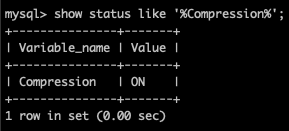
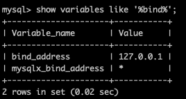

# MySQL配置文件分组及几种启动方式

对于 MySQL 的基础学习来说，配置文件以及启动相关的内容也是有一些知识点是需要我们了解的。今天，我们就来简单地学习一下配置文件分组相关的内容以及启动工具之间的区别。

## 配置文件的分组

MySQL 在配置文件中可配置的内容非常多，相信大家多少也都会接触一点。而且相信有不少刚刚开始接触的同学会和我一样，只是从网上复制一个配置放到配置文件中就可以了，相信不少同学会看到过这样的东西。

```sql
[mysqld]
xxx
xxx

[mysql]
xxx
xxx
```

在这个配置中，[] 里面的内容是什么意思呢？其实大家也能大概猜到，[mysqld] 里面的内容其实针对的就是 服务端 的一些配置。而 [mysql] 则是针对 客户端 的一些配置。

在命令行中，我们可以通过命令行参数来指定一些配置。比如说下面这两个命令。

```php
~ mysqld --bind-address=127.0.0.1

~ mysql --compress
```

像上面这样的参数信息，如果每次都要输入，那么就不如入到配置文件中更加地方便。在这个时候，我们就可以将它们配置到对应的配置组中。

```sql
[mysqld]
bind-address=127.0.0.1

[mysql]
compress
```

现在我们需要重启 MySQL 服务，当然，也要重新使用 mysql 命令连接服务器，然后查看配置的信息。





很明显，我们的配置都生效了。好了，大概的作用说明了，接下来我们就看看上面的 [] 中的内容都包括哪些。既然我这么说了，那么肯定相关的配置不只是 [mysqld] 和 [mysql] 这两个。

|  程序名   | 类别 | 能读取的组 |
|  ----  | ----  | ---- |
| mysqld  | 服务器 | [mysqld]、[server]|
| mysqld_safe  | 服务器 | [mysqld]、[server]、[mysqld_safe]|
| mysql.server  | 服务器 | [mysqld]、[server]、[mysql.server]|
| mysql  | 客户端 | [mysql]、[client]|
| mysqladmin  | 客户端 | [mysqladmin]、[client]|
| mysqldump  | 客户端 | [mysqldump]、[client]|

既然有这么多分组，那么在不同的分组中配置相同的参数，有优先级问题吗？在 MySQL 的配置中，分组的优先级非常简单，就是最后配的优先级最高。比如说下面这样。

```sql
[mysqld]
bind-address=127.0.0.1

[server]
bind-address=*
```

那么最后生效的就是 * 这个配置。如果我们同时写了两个 [mysqld] 呢？同样还是以最后一个为准。

另外，优先级最高的，则是我们在上面命令行中直接进行指定的参数，这样的优先级永远是最高的。

## 启动方式

接下来就是启动方式的学习。大家都清楚，MySQL 的服务端程序使用的是 mysqld ，但是很多人会发现，还有 mysql_safe、mysql.server 这两种启动形式也是非常常见的。那么它们有什么区别呢？

最基础的 mysqld ，是真正的 MySQL 服务端可执行文件。它会启动 MySQL 服务进程，并监听端口或 UnixSocket 文件来进行服务端的运行。但是正常情况下，我们不会直接去用命令行操作它，比如在 CentOS 中，一般我们会使用 systemctl 来操作这个服务的启动。

```php
systemctl [start|stop|restart] mysqld
```

mysqld_safe 是一个安全启动脚本，它会间接调用 mysqld 并持续的监控服务器的运行，如果发生错误，它可以帮助重启服务器程序，并且可以记录错误日志。

mysql.server 同样也是一个启动服务，它是间接地调用 mysqld_safe ，使用非常方便。

```sql
mysql.server [start|stop|restart]
```

在我的 Mac 电脑上，使用的是 brew 安装的 MySQL8 ，就是包含 mysql.server 命令的。使用 mysql.server 命令启动后，实际上启动的是一个 mysqld_safe 进程和一个它的 mysqld 子进程。就像我们之前学习过的 Swoole 中的进程运行模式一样，mysqld_safe 就像是一个 Manage 进程，用于管理监控实际运行的 mysqld 子进程，并且可以在出现问题的时候重启拉起一个新的子进程。你可以尝试 kill 掉 mysqld 子进程，会发现马上又会有一个新的 mysqld 子进程出现。

另外还有一个 mysqld_multi 这个是可以一次性运行多个服务器实例，用得不多，也就不多介绍了。

有这么几种启动方式，但你的系统中它们并不一定都会存在。比如说我使用 rpm 安装在 CentOS 中的 MySQL8 ，就没有 mysql.server 这种启动方式，为什么呢？官方文档中有特别的说明。

> 在一些 Linux 平台中，使用 RPM 或 Debian 包安装的方式，mysqld_safe 并没有什么实际作用，所以也就不需要它。因为系统运行直接管理 MySQL 服务，也就是我们最上面使用的那个 systemctl 工具，它是属于 Systemd 这个系统组件的。同样的，这个工具直接就可以实现 mysqld_safe 相关的功能（你也 kill 试一下），并且不需要再由一个主进程去创建子进程的方式进行管理，性能更好。

同理，mysql.server 是间接调用 mysqld_safe 的，所以在我的虚拟测试机的环境中也没有 mysql.server 这个命令。

## 总结

今天的内容非常基础，但是越是基础的东西反而越容易被大家忽略，就拿我来说，没有学习之前我真的只是大概知道 [mysqld]、[mysql]、[server] 这三个配置，其它的真的一点印象都没有。然后 mysqld_safe 原来也并不是都有的，现代的系统使用 Systemd 之后就不会再使用 mysqld_safe 了。好吧，学习就是这样，成长也正是这样，惊喜往往就在不经意见呈现到你面前。

参考文档：

[https://dev.mysql.com/doc/refman/8.0/en/programs-server.html](https://dev.mysql.com/doc/refman/8.0/en/programs-server.html)

[https://dev.mysql.com/doc/refman/8.0/en/using-systemd.html](https://dev.mysql.com/doc/refman/8.0/en/using-systemd.html)

《MySQL是怎样运行的——从根上理解MySQL》
