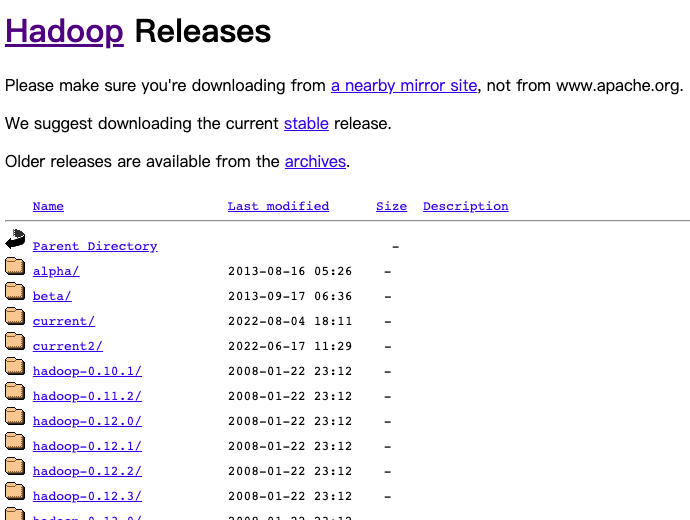
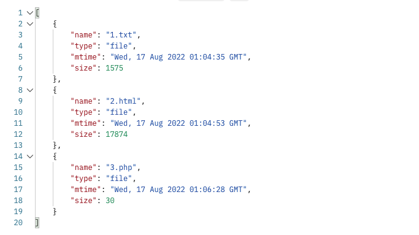

# Nginx学习：目录索引、字符集与浏览器判断模块

今天要学习的内容有几个还是大家比较常见的，所以学习起来也不会特别费劲。对于目录的默认页设置大家都不会默认，字符集的设置也比较常见，而浏览器的判断这一块，可能有同学会接触过针对 IE 浏览器的一些特殊设置。今天的内容也基本上都是可以在 http、server、location 中可以进行配置的，只有一个指令是只能在 http 中配置的，到时候会单独说。

## 默认页 index

没错，就是那个最常见的 index 指令，它是单独的属于 ngx_http_index_module 模块，不需要编译，是核心源码中的一个配置指令。不管是默认的 nginx.conf 还是用一些面板工具安装的 Nginx ，都会有这个指令的出现。

```shell
location / {
  root   html;
  index  index.html index.htm;
}
```

这就是默认配置中给的 index 指令的配置，如果是 PHP 环境，通常会把 index.php 放在前面。它的配置参数非常简单。

```shell
index file ...;
```

默认值是 index.html ，所以如果是静态页面，并且本身就有 index.html 这个文件的话，不配这个指令也行。它的作用就是定义如果是以 / 结尾的 location 路径，也就是目录路径。就会按照配置的顺序检查文件。比如上面的默认配置中，如果在 root 指定的根目录下没有 index.html 文件，就会找 index.htm 文件。如果有 index.html ，就直接会返回 index.html 文件了。那么如果这两个文件都找不到呢？404 呗。不过它还可以在最后一个元素带上一个有路径的文件，比如 /index.html 。现在我们就来配一个。

```shell
location /indextest/ {
  index index.html aaa.html a.txt /index.html;
}
```

注意，我们要在 root 指定的目录下创建一个 indextest 目录，否则即使最后有一个 /index.html ，也会一直是 404 。

```shell
mkdir /usr/local/nginx/html/indextest
```

现在这个目录里面没有配置中指定的这些文件，直接访问的话，就会返回根目录的首页文件。

接着我们可以一个一个地创建，比如先创建一个 a.txt ，再次访问，就会显示 a.txt 中的内容。这里的文件是可以自由定义的，不仅是 html 或者 txt 文本，php 之类的脚本文件都是可以的，前提是也要配好 FastCGI 。

另外需要注意的是，index 文件会引发内部重定向，请求可能会被其它 location 处理。 比如，下面这个例子：

```shell
location = / {
    index index.html;
}

location / {
    ...
}
```

请求 “/” 实际上将会在第二个 location 中作为 /index.html 被处理。这一段是官网的例子，我没有测试，其实就是 location 规则的问题。大家可以自己试试，意思就是 / 会变成 /index.html ，然后交由下面的 location 进行处理。

## 目录索引

有的时候，我们不指定 index ，而是需要直接列出整个目录里面的文件内容，比如一些开源代码的下载地址。比如说 Hadoop 的下载地址：[https://archive.apache.org/dist/hadoop/common/](https://archive.apache.org/dist/hadoop/common/)



在 Apache 中，也有类似的设置，而在 Nginx 中，只需要启用 ngx_http_autoindex_module 模块就可以了。这个模块也是核心源码中的，直接就可以使用。首先，还是要准备一些文件，比如可以用 shell 直接生成一些。

```shell
echo "this is 1.txt"{1..99}  >> /usr/local/nginx/html/indextest/1.txt
```

然后，就简单地配置一下，还是使用上面的 indextest 目录。

```shell
location /indextest/ {
  #index index.html aaa.html a.txt /index.html;

  autoindex on;
}
```

接下来直接访问 /indextest/ 路径，就可以看到下面的内容。


直接点击文件就可以打开访问对应的文件啦。

### autoindex

开启或者关闭列出目录中文件的功能。

```shell
autoindex on | off;
```

默认是 off ，当然是不能随便把目录中所有的文件信息都暴露出来啦，因此，大部分情况下都只是特殊的一些目录才会用到。如果是 off ，并且没有 index ，也没有 index.html 的话，那就是 404 。

### autoindex_exact_size

设置目录中列出的文件是显示精确大小，还是对KB，MB，GB进行四舍五入。

```shell
autoindex_exact_size on | off;
```

默认是 on ，也就是精确显示大小，设置成 off 的话，就会进行四舍五入带单位的显示。同时，它还必须是下面的 autoindex_format 设置为 html 时才会有效果。最后我们会一起看例子。

### autoindex_format

设置索引目录展示的形式。

```shell
autoindex_format html | xml | json | jsonp;
```

默认是 html ，就是我们上面看到的那个样子，还可以换成别的形式。后面我们一起测试时看效果。

### autoindex_localtime

设置目录中列出文件的时间是本地时间还是UTC时间。

```shell
autoindex_localtime on | off;
```

默认值是 off ，使用的是 UTC 时间，改成 on 之后，就是服务器的时间。

### 综合测试

现在直接配置上除上面的例子中没用到的那三个指令吧，如果是 on 的就换成 off ，off 的就换成 on ，html 也换成 json 。

```shell
  autoindex_exact_size off;
  autoindex_format json;
  autoindex_localtime on;
```

看看效果，输出的结果是不是变成了下面这样的 json 格式了。



但是大家会发现，size 表示的文件大小没有变化呀，前面说过了，autoindex_exact_size 只有在 html 的时候才会有效果。因此，我们还是要把 autoindex_format 换回 html ，这样就可以看到大小不显示的结果也不一样了。


## 字符集 Charset

字符集的模块全名是 ngx_http_charset_module 模块。记得刚开始学 PHP 的时候，还是 PHP 刚刚升级到 5 的时候，5.2 或者 5.1 是主流版本，MySQL 也是同样的刚到 5 左右的版本。在哪个时代，Discuz 或者 DedeCMS 这些开源程序都会提供 UTF8 和 GBK 两种版本，是不是感觉怪怪的，因为当时 UTF8 还没有一统天下嘛。

到了现在，基本上不管是什么软件，PHP的编辑器创建的文件、MySQL建库建表、Redis、Go语言、Java、前端，等等等等，默认全是 UTF8 了，因此，字符集会产生的乱码问题说实话已经大大减少了。包括在 Nginx 中，默认的配置文件中那那个默认的 server 里面，第四行就是一个被注释掉的 `#charset koi8-r;` 配置。能写在默认配置文件中，说明还是比较常用的，而被注释掉了，说明现在默认可能并不是完全需要了。总之，我们不敢说它一定是很重要，但确实是一个不能忽略的配置项。

咱们的测试，就设置一个 gbk ，让 utf8 乱码好了，默认的 koi8-r 我都不知道是哪里的....

```shell
  charset gbk;
```

继续复用上面的 /indextest/ 这个路径，在 location 添加上面的这条配置指令。然后随便建立一个文件，并且在里面写上文，看看访问结果是不是乱码了。其实呀，这个指令的意思是在响应头的 Content-type 中添加上 charset 参数。

默认情况下，我们访问的普通 Nginx 静态页面返回的 Content-type 就是一个 text/html ，而设置了 charset 之后，就变成了 `text/html;charset=gbk` 了。现在大部分情况下不需要设置，其实主要还是如果不设置，默认浏览器就会使用 UTF8 ，同时访问的文件也是 UTF8 的，这样就没啥问题了。另外如果是 PHP ，除去文件编辑器和普通创建的文件都会使用 UTF8 编码外，很多框架以及我们自己写 Demo 时，也会这样加上一段。

```shell
// php文件
header("Content-type: text/html; charset=utf-8");
```

当使用代理或者 FastCGI 时，默认情况下会直接使用它们返回的响应头中的 Content-type 。

### charset

为响应头的 “Content-Type” 添加指定的字符集。 

```shell
charset charset | off;
```

现在的默认值就是 off ，表明不在响应头的 “Content-Type” 中添加字符集。如果这个字符集和 source_charset 指令设置的字符集不同，就会进行转换。这个指令后面马上就会说。

它的参数也可以使用变量来指定，参数可以使用的值需要符合 charset_map 或 source_charset 的值。此外，字符集也可以在响应头的 “X-Accel-Charset” 中设置。 这个功能可以使用 proxy_ignore_headers和 fastcgi_ignore_headers 指令来禁用。

### charset_map

描述了从一个字符集到另一个字符集的转换表。这个配置指令只能配置在 http 模块中，不能放到 server 或 location 里面。

```shell
charset_map charset1 charset2 { ... }
```

默认值是空的，意思就是从 charset1 到 charset2 的转换，比如说 UTF8 到 GBK 的转换规则，配置比较复杂，比如这样：

```shell
charset_map koi8-r utf-8 {
    C0 D18E ; # small yu
    C1 D0B0 ; # small a
    C2 D0B1 ; # small b
    C3 D186 ; # small ts
    ...
}
```

我们下载的安装包中已经提供了从`koi8-r`到 `windows-1251`，从`koi8-r`到`utf-8`，以及从 `windows-1251`到`utf-8`的完整转换表。都不是我们常用的，这一块大家了解一下就好啦。

### charset_types

使模块在响应时能处理除了 “text/html” 之外其他指定的MIME类型。

```shell
charset_types mime-type ...;
```

默认值包含 text/html text/xml text/plain text/vnd.wap.wml application/x-javascript application/rss+xml 这些。这个配置其实和我们上篇文章中学过的 addition_types 一样，就是说这些类型的会让 charset 指令产生效果，如果有特殊需求可以再继续添加。

### override_charset

对于接收到的代理服务器或者 FastCGI 服务器的响应头中 “Content-Type” 已经带有字符集的情况，确定是否进行字符集转换。

```shell
override_charset on | off;
```

默认值是 on ，如果开启转换，接收到的响应中指定的字符集会被当作原始字符集。如果在子请求中接收到的应答，始终会将应答的字符集转换为主请求的字符集，无论 override_charset 指令是否开启。

我拿 PHP 试了，没啥效果，会直接报 500 错误，PHP 中使用 header 指定字符集为 UTF8 ，然后 Nginx 中设置的 Charset 还是 gbk 。错误信息是指定的字符集在 charset_map 或 source_charset 中不存在。也没找到合适的 UTF8 转换 GBK 的 charset_map 文件，所以这一块也就不知道怎么继续测试啦。有了解的小伙伴记得评论留言哦。

### source_charset

定义响应中的原始字符集。

```shell
source_charset charset;
```

默认是空的，没有设置。如果这个指令配置的字符集与 charset 配置的不一样，就会进行转换。

## 浏览器判断 browser

在浏览器判断的 ngx_http_browser_module 模块中，有一个变量你肯定见过，那就是 `$msie` 这个变量。用于判断当前请求过来的浏览器是不是 IE 浏览器，如果是的话，这个变量的值就会变成 1 。

除了这个变量之外，这个模块里面还提供了三个模块，另外还有几个指令，是对这几个变量进行配置以及赋值的。也就是说，整个模块其实都围绕下面的这三个变量。

- `$modern_browser` 如果浏览器被为识别为新式浏览器，该值等于 modern_browser_value 指令设置的值。
- `$ancient_browser` 如果浏览器被识别为旧式浏览器，该值等于 ancient_browser_value 指令设置的值。
- `$msie` 如果浏览器被识别为任何版本的MSIE，该值等于 “1” 。

这些变量有啥用呢？别急，后面测试的时候再看，先来看看在这个模块中的配置指令，一共就四个。

### ancient_browser

如果任一指定的子串在请求头的“User-Agent”域中被发现，浏览器将被认定为旧式浏览器。

```shell
ancient_browser string ...;
```

它的默认值是空的，没有默认值，而另外一个 ancient_browser_value 配置的默认值是 1 ，也就说，如果使用普通的 if 不带等于的进行布尔判断，那么 `$ancient_browser` 将一直返回 1 。这个我们后面测试时会见到效果。

### ancient_browser_value

设定变量 `$ancient_browser` 的值。

```shell
ancient_browser_value string;
```

上个指令中就介绍过了，它的默认值是 1 ，当然也可以设置成别的值，而且不一定是数字，字符串也可以。可以用在 if 判断上。但是如果直接设置了这个值，那么后续任何别的操作都没用了，`$ancient_browser` 会一直是这个配置指令设置的值。

### modern_browser

指定一个版本，此版本及后续版本的浏览器都被认定为新式浏览器。

```shell
modern_browser browser version;
modern_browser unlisted;
```

浏览器可以是下列之一： msie, gecko (基于Mozilla), opera，safari, 或者 konqueror 。注意这里没有 Chrome 哦，Chrome 也是基于 Mozilla 的，因此用 gecko 就可以了。

版本可被指定为以下形式：X, X.X, X.X.X, 或 X.X.X.X。 每一形式的最大值分别是4000, 4000.99, 4000.99.99, 和 4000.99.99.99 。

如果浏览器既没有在 modern_browser 中列出，又没有在 ancient_browser 中列出时，并且配置了特殊值 unlisted ，那么浏览器将被认定为新式浏览器，否则认定为旧式浏览器。 如果请求头中没有 “User-Agent” 域，浏览器以没有列出对待。

看着有点懵吧？其实它就是和 ancient_browser 反过来的，马上在例子中我们就可以看到效果。

### modern_browser_value

设定变量 `$modern_browser` 的值。

```shell
modern_browser_value string;
```

和 ancient_browser_value 的意思是一样的，它的默认值同样也是 1 ，但是，注意 modern_browser 定义中说的那些内容，如果是默认情况下，modern_browser 是空的，即使你下载最新版本的浏览器也不会判断为新式浏览器，因此，最终 `$modern_browser` 的值在默认情况下其实是个空的。

### 测试 browser

看上面的变量和配置项有点晕吧？其实这一块就是帮助我们用自己定义的标准来判断指定的浏览器，将这个浏览器归属到 新式 或 旧式 浏览器这两个阵营中。然后使用两个变量就可以通过 Nginx 中的编程语法，比如 if 来进行一些特殊的判断。

```shell
location /browsertest/ {
  add_header Content-Type text/plain;
  
  #ancient_browser_value 0;
  
  modern_browser safari 600.0.0;

  ancient_browser safari;

  if ($ancient_browser) {
  	#return 301 /indextest/1.txt;
  }

  return 200 $modern_browser,$ancient_browser,$msie;
}
```

在上面的例子中，先不看注释的部分。modern_browser 我们设置了一个 safari ，版本号是 600.0.0 ，意思就是只要是大于等于这个版本的 safari 浏览器，就会判定为新式浏览器，`$modern_browser` 会变成 1 ，而 `$ancient_browser` 会变成空的字符串。反过来，如果不是 safari 浏览器，或者版本小于指定的版本号，上面两个变量的值就会反过来。最后，我们通过 return 直接打印这三个变量的值。

怎么测试呢？我们可以通过 Postman 来重写请求头的 User-Agent 字段实现。


这一大串的字符怎么来的？拿真的浏览器请求一下，然后用开发者工具查看请求头复制出来嘛。然后我们就好操作了，直接更改这一段字符串中最后的那个版本号标识就好啦。

截图中的这个版本号，返回的结果是 ",1," 这样的内容。而如果我们改成 600.1.15 ，结果就会变成 "1,," 这样。

接着，我们可以打开上面代码中 if 代码段内的注释，如果判定为 旧式 浏览器，那么就直接 return 进行 301 跳转到最开始的 indextest 目录，并打开 1.txt 文件。这就是模拟我们可能会对一某些浏览器有一些特殊的操作。如果判定不是 旧式 浏览器的话，还是正常返回那三个变量的值。这就是变量在 Nginx 编程中的重要作用。

这个 if 是不是很像我们的编程语法呀？但其实，它也是个配置指令，或者你可以将整个 Nginx 中的配置指令都看成是一种编程语言的语法。就像 HTML 是超文本标记语言一样，Nginx 的配置指令可以说也是构建在主体的 C/C++ 程序之上的一套配置标记语言。关于 if 更详细的内容，在后面的重写模块中会再详细的学习。

最后上面那个 ancient_browser_value 注释大家也可以打开试下，不出意外的话，现在你怎么修改版本号，怎么配其它的指令，一直都会是 ",0," 这样的返回结果。

## 总结

没骗大家吧？index 和 charset 肯定是大家比较常见的配置指令。而且是非常常见，index 在默认的配置文件中就成，而 charset 虽然没有直接给出，但在默认配置文件的注释中也能看到，这就说明它也真的是非常常用的一种配置指令。另外就是 `$msie` 这个变量估计不少同学是见过的，也可能在你的项目就就会对 IE 进行一些特殊的处理。

好了，继续接下来的学习吧，这样刷文档的感觉咋样？反正我现在发现官方文档真的是我们的第一学习神器哦！

参考文档：

[http://nginx.org/en/docs/http/ngx_http_index_module.html](http://nginx.org/en/docs/http/ngx_http_index_module.html)

[http://nginx.org/en/docs/http/ngx_http_autoindex_module.html](http://nginx.org/en/docs/http/ngx_http_autoindex_module.html)

[http://nginx.org/en/docs/http/ngx_http_charset_module.html](http://nginx.org/en/docs/http/ngx_http_charset_module.html)

[http://nginx.org/en/docs/http/ngx_http_browser_module.html](http://nginx.org/en/docs/http/ngx_http_browser_module.html)

