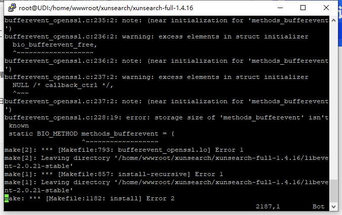

# 安装运行并测试XunSearch

这回的新系列，我们将学习到的是一个搜索引擎 迅搜 XunSearch 的使用。这个搜索引擎还是有一点名气的，而且也是一下在更新的，虽说现在 ElasticSearch 已经是实际上的搜索引擎霸主了，而且还有 Solr 在后的不断追赶，但要说最简单、最实在，而且最容易让我们这些 PHPer 上手的，绝对还是 XunSearch 。

在我的学习过程中，发现很多人其实对搜索引擎工具的认识不足，而且也会有很多同学在吐槽 XunSearch 官方文档不好。这些呀，其实根本都都还是在于概念定位的不清晰。因此，除了基本的 XunSearch 的学习，我们还会顺便略讲一点点搜索引擎的相关知识，也会顺道地看一看组成 XunSearch 的核心组件 SCWS 和 Xapian 。

讲 XunSearch 的文章不少，视频也有一点，但可能像我们这个系列一样详细学习的不多。有一说一，这一系列可能真的是全网唯一了。

## 安装

XunSearch 的安装相对来说还是比较简单的，普通测试的本地安装，可以使用 Docker 的方式，后面再说，先说一下官网文档中的在 Linux 下面的安装。

### Linux 安装

没啥别的，上来就是先装一堆需要的环境软件。如果是 CentOS 系列的话，直接 yum 安装就好了。我这里使用的是 CentOS8 。

```shell
> yum install -y bzip2 gcc wget automake autoconf libtool make kernel-headers kernel-devel  zlib-devel gcc-c++ libevent libevent-devel
```

安装完需要依赖的环境软件之后，就可以安装官网的步骤来进行安装了。下载最新的版本，解压，执行 `setup.sh` 就行了，简单到没朋友。

```shell
> wget http://www.xunsearch.com/download/xunsearch-full-latest.tar.bz2
> tar -xjf xunsearch-full-latest.tar.bz2
> cd xunsearch-full-1.4.17/
> sh setup.sh
+==========================================+
| Welcome to setup xunsearch(full)         |
| 欢迎使用 xunsearch (完整版) 安装程序     |
+------------------------------------------+
| Follow the on-screen instructions please |
| 请按照屏幕上的提示操作以完成安装         |
+==========================================+

Please specify the installation directory
请指定安装目录 (默认为中括号内的值)
[/usr/local/xunsearch]:

Confirm the installation directory
请确认安装目录：/usr/local/xunsearch [Y/n]y
………………………………
> /usr/local/xunsearch/bin/xs-ctl.sh restart
```

中间需要关注的是，在执行 `sh setup.sh` 之后，需要确认安装目录，这个目录可以使用默认的，也可以自己定义一个，一般我们选择默认的就好了。安装后的所有内容就在 `/usr/local/xunsearch` 这个目录下面。

最后就是使用安装目录下面的 `bin` 目录下面的 `xs-ctl.sh` 运行起整个 XunSearch 环境。如果没有任何报错信息，就可以通过 `netstat -ntlp` 查看软件的端口占用，XunSearch 使用的是 8383 和 8384 这两个端口。

这个时候，你会发现端口是和 127.0.0.1 绑定的，就像之前学习过的 Redis 中的内容一样，这样绑定的端口外部是无法访问的。因此，如果需要外部能够访问到这台 Linux 上的这两个端口，就需要添加一个启动参数。

```shell
> /usr/local/xunsearch/bin/xs-ctl.sh stop
> /usr/local/xunsearch/bin/xs-ctl.sh -b inet start
```

我们可以通过 `stop` 停止服务，然后再使用 `-b inet` 参数重新启动 XunSearch ，现在再次通过 `netstat -ntlp` 就可以看到端口绑定已经是 0.0.0.0 了。

在这些年的使用和学习过程中，整个安装过程，我基本没有踫到过什么问题。但一些同事在安装过程中遇到过系统 openssl 版本高的问题，比如下面这样的报错信息。



这种报错就需要要替换一下 XunSearch 中的 libevent ，主要就是操作系统的软件版本高了，而 XunSearch 自带的这个 libevent 版本低了，需要按下面的步骤换一个。

```shell
// 下载新版本的
> wget https://github.com/libevent/libevent/releases/download/release-2.1.12-stable/libevent-2.1.12-stable.tar.gz
//先将libevent解压（以便压缩成所需格式）
> tar -zxvf libevent-2.1.12-stable.tar.gz
//压缩成bz2格式，这是迅搜安装包的支持的格式
> tar -cjf libevent-2.1.12-stable.tar.bz2 libevent-2.1.12-stable
//复制到xunsearch下的packages文件夹内
> cp libevent-2.1.12-stable.tar.bz2 xunsearch-full-1.4.17/packages/
//进入安装包的目录并将原来自带的libevent安装包删除（xunsearch1.4.17自带的是2.0.X）
> cd xunsearch-full-1.4.15/packages/
> rm -f libevent-2.0.X
//返回上一步的文件夹（即迅搜安装包的根目录），然后执行setup.sh就可以了，
//迅搜会自动检查安装包文件内的libevent开头的安装包，如果没找到会报错，如果找到了就会自动解压并编译安装
> cd ..
> ./setup.sh
```

### Docker 安装

上面是 Linux 下面的安装，之前我如果要使用学习 XunSearch 的话也需要在本地搭虚拟机环境，不过现在就方便多啦，直接用  Docker 就可以非常快速地在本地搭建起一套学习环境，而且 Win 和 Mac 都适用哦。

```shell
docker run --name xunsearch -d -p 8383:8383 -p 8384:8384 -v /Users/zhangyue/XunSearch/data:/usr/local/xunsearch/data hightman/xunsearch:latest
```

这个就不多解释了，端口原样映射，然后把数据目录挂载出来就可以了。注意，还有一个 etc 目录，后面我们学习自定义词典时，如果你想通过 docker 来操作自定义词典，就需要将 etc 目录挂载出来，不过需要提前先准备一个不挂载的容器实例并将其中的 /usr/local/xunsearch/etc 目录导出来，然后复制到挂载目录。因为 docker 会用宿主机挂载目录替换容器内部目录，如果直接挂载，就会导致没有可用词典的情况。

具体内容可以查阅 Docker 相关学习资料。

## 官方测试脚本

好了，上面的安装步骤完成之后，我们就要来进行测试了。XunSearch 不像 ElasticSearch 一样，自带 RESTFul 接口，直接安装完成就可以像用命令行一地就进行测试。XunSearch 是需要使用客户端的，即使是底层的 Xapian ，在其官网文档上，也是直接使用 Python 客户端来进行测试的。这个 Xapian 是个啥玩意，我们后面再细说，反正现在大家就是要知道，我们现在就必须使用 XunSearch 提供的 PHP 的 SDK 包来进行连接和测试了，这个就相当于是一个客户端。

在我们存放测试代码的目录中，直接使用 Composer 安装 XunSearch 的官方扩展包就行。

```shell
# xxxxxxxx/MyDoc/博客文章/dev-blog/xunsearch/source
composer require hightman/xunsearch
```

使用 Composer 安装完成之后，就会在当前目录生成 vendor 包，SDK 文件也会在这里面。在 XunSearch 的官方 SDK 包中，直接就有一堆现成的工具可以使用，这些内容也在官方文档上有说明。咱们今天还是先简单的看看。首先，就是导入测试数据。

```shell
➜  source git:(master) ✗ php vendor/hightman/xunsearch/util/Indexer.php --source=csv --clean demo
清空现有索引数据 ...
初始化数据源 ... csv 
WARNING: input file not specified, read data from <STDIN>
开始批量导入数据 (请直接输入数据) ...
```

是的，直接命令行模式运行 `vendor/hightman/xunsearch/util/Indexer.php` 这个文件，这个文件就是官方提供的工具包中的索引操作文件。后面的参数表示的是 `--source` 数据来源，这里我们是使用的 csv ，然后直接手动输入。其实它还可以指定一个文件直接导入整个文件的，另外这个数据源选项也可以指定为 MySQL 等其它各种数据来源。这些我们都放到后面再细说。

接下来的是 `--clean` ，表示清空索引。后面的 `demo` ，表示使用 `demo` 这个索引文件。这些都是什么鬼？别急，先照着来，在后面的学习中我们会一一学习，今天的任务是首先要安装好，能够跑起来，并能够进行简单地测试。

好了，光标停在这里不动了，我们现在可以复制官网的例子语句来输入。

```shell
1,关于 xunsearch 的 DEMO 项目测试,项目测试是一个很有意思的行为！,1314336158
```

回车之后没啥反应，好吧，先继续输入后面两条。

```shell
2,测试第二篇,这里是第二篇文章的内容,1314336160
3,项目测试第三篇,俗话说，无三不成礼，所以就有了第三篇,1314336168
```

输入完成之后，使用 `Ctrl+D`  快捷键结束输入，注意，这个快捷键是输入结束的意思，也可以用来取代 exit 的输入。而我们常用的 `Ctrl+C` 是中断程序的意思，这里不要用错了哦。Windows 的命令行需要使用 `Ctrl+z` 。

```shell
INFO: reach end of file or error occured, total lines: 3
完成索引导入：成功 3 条，失败 0 条
刷新索引提交 ...
```

这下有反应了吧，显示成功了 3 条。紧接着，我们再用官方提供的工具来进行查询。上面的步骤就像是我们将那三行数据 Insert 进了数据库，而接下来我们就要 Select 一下。这回我们使用 `vendor/hightman/xunsearch/util/Quest.php` 这个工具。

```shell
➜  source git:(master) ✗ php vendor/hightman/xunsearch/util/Quest.php demo 项目                  
在 3 条数据中，大约有 2 条包含 项目 ，第 1-2 条，用时：0.0273 秒。

1. 关于 xunsearch 的 DEMO 项目测试 #1# [100%,0.44]
项目测试是一个很有意思的行为！ 
Chrono:1314336158  

2. 项目测试第三篇 #3# [99%,0.44]
俗话说，无三不成礼，所以就有了第三篇 
Chrono:1314336168  
```

后面的参数，第一个 `demo` 表示查询 `demo` 索引下面的内容，第二个 `项目` 就是我们的查询关键字，就像是你在百度的搜索框中输入的文字一样。

结果是不是我们想要的内容呢？现在你可以继续再测试别的关键字。比如：

```shell
php vendor/hightman/xunsearch/util/Quest.php demo 测试
php vendor/hightman/xunsearch/util/Quest.php demo 项目测试
php vendor/hightman/xunsearch/util/Quest.php demo 俗话说
php vendor/hightman/xunsearch/util/Quest.php demo 莫须有
php vendor/hightman/xunsearch/util/Quest.php demo 项
```

注意最后一个搜索的关键字，有没有发现什么问题呢？这个咱们后面会细说哦，很多人在没有系统的学习搜索引擎相关知识前，会对这里产生很大的疑惑。官网文档的评论，还有 XunSearch 的 Github 的 issue 中，很多人都会出现这个问题进面否认 XunSearch 的能力，其实，可能真的只是大家误会了。扯远了，还是先以今天的任务为主，后面咱们会好好说这个问题。

## PHP 中查询

官网的 SDK 可不止是上面的那些工具呀，它本身就是一个 Composer 包，本身就是给我们的项目所使用的扩展包。因此，其实更多情况下，我们在业务代码，也就是普通 PHP 中进行开发才是这个扩展包最重要的作用。那么在 PHP 中，我们要如何使用呢？

```php
// 1.php
require_once 'vendor/autoload.php';

$xs = new XS('demo'); 

$doc = $xs->search->search("项目");

print_r($doc);
```

额，就这么四行，效果和上面的查询工具的效果是一样的。简单的我都不想解释了，不过本着完整详尽的原则，咱们还是来说一说吧。

先是 require_once ，这个不用多解释了吧，Composer 基础知识，不记得的小伙看我最早最早的 Composer 小系列，公众号或者博客上搜一下就好了。

然后就是实例化一个 XS 对象，这个对象可以看做是 XunSearch 的一个实例，它的构造参数需要一个索引名称，这里我们还是使用那个 `demo` 索引。

接下来，通过 XS 对象的 search 属性，返回一个 XSSearch 对象，然后再通过这个对象的 search() 方法，来实现查询。这里我就直接是链式调用，一行写完了。注意，别看到两个 search 就发懵了，第一个是一个 search 属性，返回的是另一个对象哦。

接下来测试一下吧！

```shell
➜  source git:(master) ✗ php 1.php
Array
(
    [0] => XSDocument Object
        (
            [_data:XSDocument:private] => Array
                (
                    [pid] => 1
                    [subject] => 关于 xunsearch 的 DEMO 项目测试
                    [chrono] => 1314336158
                    [message] => 项目测试是一个很有意思的行为！
                )

            [_terms:XSDocument:private] => 
            [_texts:XSDocument:private] => 
            [_charset:XSDocument:private] => UTF-8
            [_meta:XSDocument:private] => Array
                (
                    [docid] => 1
                    [rank] => 1
                    [ccount] => 0
                    [percent] => 100
                    [weight] => 0.43975225090981
                )

        )

    [1] => XSDocument Object
        (
            [_data:XSDocument:private] => Array
                (
                    [pid] => 3
                    [subject] => 项目测试第三篇
                    [chrono] => 1314336168
                    [message] => 俗话说，无三不成礼，所以就有了第三篇
                )

            [_terms:XSDocument:private] => 
            [_texts:XSDocument:private] => 
            [_charset:XSDocument:private] => UTF-8
            [_meta:XSDocument:private] => Array
                (
                    [docid] => 3
                    [rank] => 2
                    [ccount] => 0
                    [percent] => 99
                    [weight] => 0.43939647078514
                )

        )

)
```

输出的结果是 XSDocument 对象形成的数组，在对象中，我们看到了搜索结果的属性。

到些为止，整个安装、测试过程就完成了。咱们的第一课就这样愉快的结束咯。

## 总结

好吧，好吧，相信你和我一样，还有着不少的疑问。如果你没有学习过 ElasticSearh ，也没有接触过任何搜索引擎相关的知识，那么你一定会发出这样的感慨：搞了半天搞了个啥呀这是。因为这也是我当初的感慨。别急，B 站里任意一个 ElasticSearch 相关的视频，至少都会讲6、7个小时，咱这刚开始，一步一步来，别急嘛。先完成第一步，搭起环境，测试连通，都没问题之后，我们下篇文章就开始讲最重要的原理了，到底啥是搜索引擎，并且正式介绍一下 XunSearch 到底是个啥！

测试代码：

[]()

参考文档：

[http://www.xunsearch.com/doc/php/guide/start.installation](http://www.xunsearch.com/doc/php/guide/start.installation)

[http://www.xunsearch.com/doc/php/guide/start.demo](http://www.xunsearch.com/doc/php/guide/start.demo)

