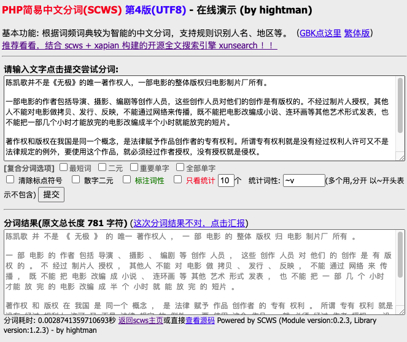
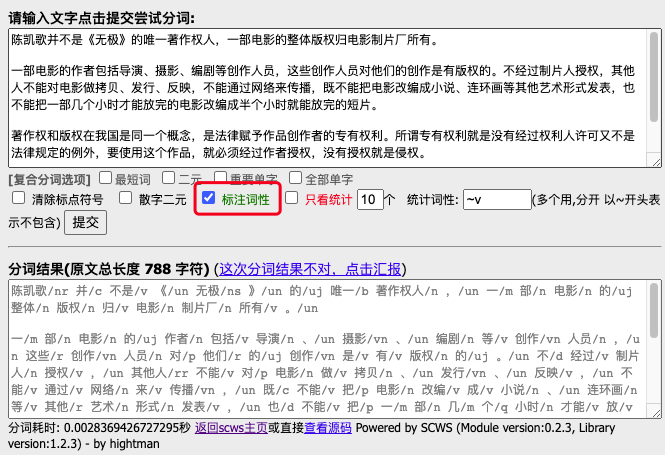
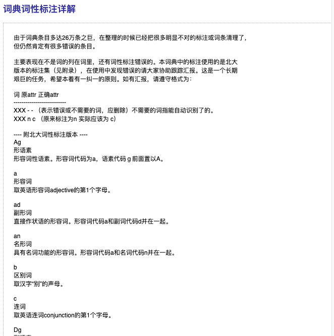
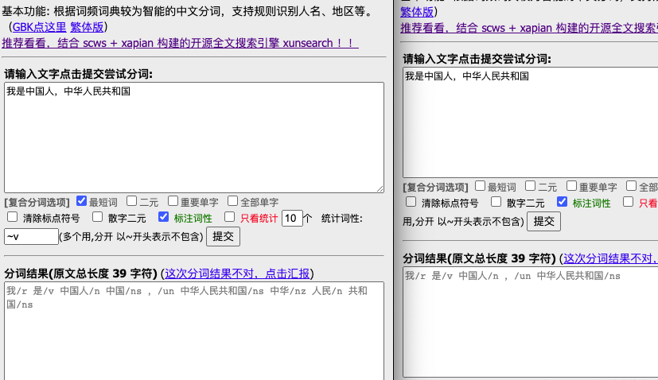
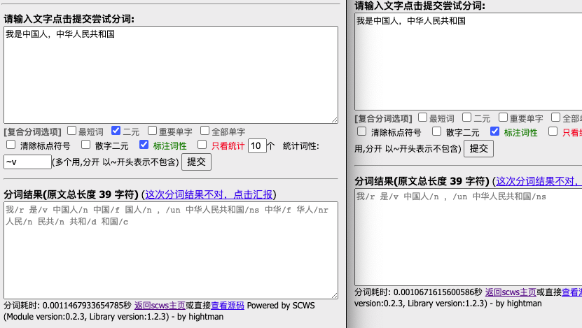
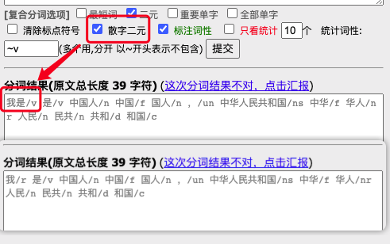
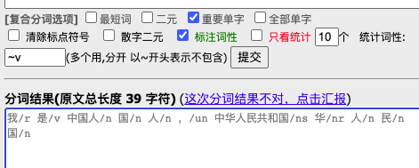
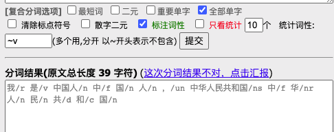
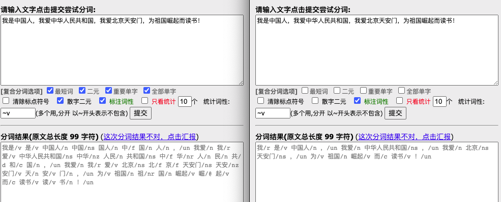

# SCWS分词（一）概念、词性、复合分词等级

正式进入到分词部分的学习了，这也是我们搜索引擎学习的最后一个部分了。在这里，我们还是以 XS 默认的 SCWS 分词器为基础进行学习，但是，就像之前的其它内容一样，原理和概念部分的内容很多都是相通的。即使你将来要用 Jieba 分词或者 IK 分词，它们所有的原理和 SCWS 都是大差不差的。

其实之前已经说过一点分词的问题了，这回咱们再来详细的说说。

## 中文分词

搜索引擎最大的特点，就是它有一个很强的检索约束条件，那就是用户输入的查询词。可以说，查询词是搜索引擎进行检索的最核心的信息。但是很多时候，用户输入的查询词是含糊的、不精准的，甚至是带有错误的。还有一种可能是，用户输入的查询词不在倒排索引中。这个问题我们之前已经多次说过了，你查不到数据，不一定是搜索引擎的锅，XS 查不到的，ES 也不一定查得到。

分词粒度分析是中文搜索中特有的一个环节。因为中文词和英文词相比，最大的区别是词与词之间没有明确的分隔标志（空格）。

比如：“I am Chinese”，以英文分词就是空格即可，“I”、“am”、“chinese”，即使是简写“I'm Chinese”，也可以通过同义词功能，将 “I'm” 与 “I”、“am” 做成同义词就可以实现了。英文中比较复杂的是时态、复数相关的问题（之前我们在同义词的文章中有测试过英文词根的问题），但这些不管是使用字典、同义词，或者是规则，相比中文都是小意思。

现在，“我是中国人”，请说一下要怎么分词？以我们自然语言的角度，应该是“我”、“是”、“中国人”，对吧。但是，如果是机器分词，“中国”、“人”，是可以分开的吧？也可以变成“中”、“国人”，“国人”也是一个常见词呀！“我”、“是”也可以变成“我是”。五个字，分词组合方式就出现了好几种了。这就是中文分词的难度。同样的，日文以及其它不像英文以天然空格分隔的语言都会有这种问题。

因此，对于中文的搜索输入，我们要做的第一件事情，是利用分词工具进行合理的分词。但分词，就会带来一个分词粒度的问题。那么怎么去确定两个字，或者多个连在一起的字，是一个词呢？传统的方式就是使用分词器，这个分词器其实在底层又是根据分词字典以及一些分词规则来进行分词的。也就是说，分词并不神秘，它是有字典为依据，然后通过一定的规则算法，将我们输入的内容按照一定规则进行切割，从而获取所输入文本的全部分词内容的。

别跟大公司和大佬们比，现在 NPL 自然语言处理技术已经非常强大了，而且都是使用高大上的人工智能、机器学习相关的技术，咱们攀不上。分词，也是 NPL 的一个应用场景。而我们要学习的，其实是最基础的机械分词法，就是上面说的，通过字典及规则进行分词。

## SCWS

SCWS 是 Simple Chinese Word Segmentation 的首字母缩写（即：简易中文分词系统）。开发者就是我们 XS 的开发者，heightman 大佬。它是采用纯 C 语言开发，不依赖任何外部库函数，可直接使用动态链接库嵌入应用程序， 支持的中文编码包括 GBK、UTF-8 等。此外还提供了 PHP 扩展模块， 可在 PHP 中快速而方便地使用分词功能。

SCWS 在分词算法上并无太多创新成分，采用的是自己采集的词频词典，并辅以一定的专有名称，人名，地名， 数字年代等规则识别来达到基本分词，经小范围测试准确率在 90% ~ 95% 之间， 基本上能满足一些小型搜索引擎、关键字提取等场合运用。首次雏形版本发布于 2005 年底。

SCWS 使用的是 xdb 格式的字典，最新提 2016 年更新的，大约 28 万词，只有 3.84MB 。很明显是有压缩过的，并且词典也是有其索引规则的，否则也不会那么快地完成分词。

它是开源的，所以大家可以直接在 Github 上查看源码，C/C++ 开发的咱就不研究了。后面主要学习还是它的使用及一些概念性的内容。官方网站和文档是文章下方参考链接的第一条链接。

### 官网测试工具

通过官网的这个测试链接：[http://www.xunsearch.com/scws/demo.php](http://www.xunsearch.com/scws/demo.php) ，选择 UTF8 版本，可以打开官方的一个 SCWS 的测试页面。



通过这个工具，我们可以方便地进行测试，后面的截图主要就是以这个页面为主。第一个文本框是原文，中间是一些选项，下面的文本框展示的就是分词的结果。

下面我们就马上来学习两个非常重要的概念，也是我们之前的学习中经常会出现的两个内容。

## 词性

词性，就是一个词的性质，这里就要考验大家的语文水平了。不管是中文还是英文，抑或是其它各种语言，词性都是相通的。比如说名词、动词、助词这些。一般，名词会以 n 表示，动词则是 v 。SCWS 在建立字典的时候，也可以让我们为自定义的单词标词性。不同的词性，对于词频、逆文档频率以及综合评分都会有影响。比如说，“的”、“地”这类的助词，一般来说在文章中的评分就会非常低，因为它们的出现频率很高，实用性（检索相关性）却很低。

上述内容是我自己的理解哦，但对于搜索引擎来说，整体概念是差不多的。也就说，词性，会影响这个词在文档以及检索时的综合评分权重。

在官方的测试工具上，我们可以勾选标注词性，就可以看到分词后每个词的词性。



可以看到，在分词结果中，每个词的后面都跟上了这个词所对应的词性。SCWS 所支持的所有词性在它的文档底部全部列了出来。



内容非常多，具体的文档链接在这里 [http://www.xunsearch.com/scws/docs.php#attr](http://www.xunsearch.com/scws/docs.php#attr) ，大家可以好好看一下。不过通常来说，在后面我们学习自定义词典时，也可以不用标注具体的词性。这一块不仅是在传统机械式词典和分词器中有用，对于 NPL 以及机器学习的语料处理来说，词性标注也是非常重要的内容。大家至少要了解这个概念，所有的分词器，只要是有用到字典的，都会有词性这个东西。

词性标注是一个重要的概念，也有很多词性标注标准，SCWS 使用的是“北大标注”。更加详细的内容如果大家有举的话，可以自己再进行深入的了解，能力水平有限，我这里就不多说了。

##  复合分词等级

复合分词等级，就是我们对于文本的分词规则，在分词库的基础上，按照一定的规则进行更为详细的拆分。对应上面的工具中间部分，主要有最短词、二元分词、重要单字、全部单字几种。其中二元分词又包括一种散字二元的形式。默认情况下，可以不用复合分词，也就是完全按照字典以最优匹配来切分单词，就是上面截图中的效果。接下来，我们就一个一个测试一下。

### 最短词



勾选了最短词效果之后，很明显就能看到效果的不同了吧。默认情况下，“中国人”这三个字肯定是在字典库中存在的，而且得分会比“中国”要高。因此，在默认情况下，针对这三个单字在一起的情况，直接会返回一个“中国人”。而如果使用最短词，则会将“中国”也带出来。后面的“中华人民共和国”也是类似的效果。从这里可以看出，最短词其实就是只要匹配到字典中的单词，就会进行多次拆分，而不是一次最优拆分。同时返回的词是能够匹配到的最短单词。

### 二元



二元的效果也很明显吧，它不管是不是标准词，在最优拆分之后，还继续给出了两个字两个字的拆分效果。“民共”、“和国”这种明显不是我们传统意义上的有意义的标准词汇，在字典中应该也是不存在的。至于这种词的词性是怎么算的，这个我就不清楚了，但肯定也是有固定算法的。

另外还有一个散字二元的效果。



其实可以看出来，针对“我”、“是”这种零散的代词、动词以及一些助词，会将它们组合成一个二元词，这就是散字二元的作用。

### 重要单字和全部单字



重要单字的效果也很明显吧，最短词是有意义的词、二元是将分词结果再进行二元组合不管意义，而重要单字就是将分词结果中的比较重要的单字再拿出来切分。剩下的全部单字也不用多说了吧。



### 组合使用

上述这些复合分词的选项，其实是可以组合使用的，比如我们全勾上。



怎么样，看到和原始不使用复合分词效果的区别了吧。拆分粒度非常细。之前我们说过的，如何以一个单字来进行模糊查询，就是实现我们最早提出的 like "%项%"，这样的效果，就可以在建立索引和查询时，将字段的复合分词等级设置到最高。

### 复合分词等级使用

不管是配置文件，还是 XSSearch 对象中的 setScwsMulti() 方法（这个方法上节课刚讲过）。都是以数字的形式来定义复合分词等级的，在配置文件中就是指定 tokenizer 为 scws ，然后使用括号并带上参数，比如 `tokenizer=scws(1)` ，表示使用最短词。

复合分词等级的常量标号为：1表示最短词，2表示二元，4表示主要单字，8表示所有单字。使用方式和 Linux 中的权限设置一样，就是权限那个 1、2、4代表r、w、x 的效果一样。设置为3，表示1+2，也就是最短词和二元一起使用；设置为6表示4+2，也就是二元+主要单字，设置为10表示2+8，二元+所有单字；依次类推，设置为 15 表示我们上面的全部勾选的效果。它的取值范围就是 1-15 。默认在代码中，使用二元，直接就会有散字二元的效果，标点符号会自动过滤。

```php
$search->setScwsMulti(2);
echo $search->setQuery("我是中国人，中华人民共和国")->getQuery(), PHP_EOL;
// Query((我是@1 AND (中国人@2 SYNONYM (中国@79 AND 国人@80)) AND (中华人民共和国@3 SYNONYM (中华@80 AND 华人@81 AND 人民@82 AND 民共@83 AND 共和@84 AND 和国@85))))
```

看看是不是和上面勾选二元和散字二元那张截图的效果一样。同时，现在对于每个词后面的那个数字应该也能猜到是什么了吧，没错，就是它的词性。在 XS 的查询分析结果中，二元分拆出来的二元词，或者说是复合分词的内容，都会以同义词 SYNONYM 的方式参与到搜索条件中。

```php
$search->setScwsMulti(2);
echo $search->setQuery("我是中国人，中华人民共和国")->getQuery(), PHP_EOL;
// Query((我是@1 AND (中国人@2 SYNONYM (中国@79 AND 国人@80)) AND (中华人民共和国@3 SYNONYM (中华@80 AND 人民@81 AND 共和国@82))))
```

单字的效果不会显示出来，后面我们会验证在 XS 代码中，单字复合分词的效果如何。

在 ES 中使用 IK 分词器时，也会有 ik_max_word 和 ik_smart 两种，ik_max_word 会拆分得很细，类似于 SCWS 中 1+2 的效果，但达不到单字的水平。

## 命令行工具

使用命令行工具也可以直接调用 SCWS ，在安装目录的 bin 目录下，有 scws 这个工具。这个我们拿虚拟机原生安装的 XS 来进行测试，当然，你也可以进入 Docker 的命令行来测试。

```shell
# /usr/local/xunsearch/bin
[root@localhost bin]# ./scws -i "我是中国人，我爱北京天安门！" -c utf-8 -A -d ../etc/dict.utf8.xdb -M 2
我/r 是/v 中国人/n 中国/f 国人/n ，/un 我爱/n 北京/ns 天安门/ns 天安/n 安门/v ！/un
+--[scws(scws-cli/1.2.3)]----------+
| TextLen:   42                  |
| Prepare:   0.0001    (sec)     |
| Segment:   0.0001    (sec)     |
+--------------------------------+
```

其实吧，有了这个命令行工具，大部分的编程语言都可以直接通过调用这个工具来使用 SCWS 进行分词了。上面的 `-i` 表示输入的文本，`-c` 表示输入的字符集，`-A` 表示显示词性，`-d` 指定字典（如果不指定字典，就会单字拆分），`-M` 指定复合分词等级。具体的内容大家可以查阅官方文档，也可以直接看下这个工具的帮助说明。

```shell
[root@localhost bin]# ./scws -h
scws (scws-cli/1.2.3)
Simple Chinese Word Segmentation - Command line usage.
Copyright (C)2007 by hightman.

Usage: scws [options] [input] [output]
  -i <file|string> input string or filepath
                   (default: try to read from <stdin> everyline)
  -o <file>        output filepath (default to <stdout>)
  -c <charset>     set the charset (default: gbk)
                   charset must been same with dictionary & ruleset
  -r <file>        set the ruleset file (default: none)
  -d <file>        set the dictionary file[s] (default: none)
                   if there are multi files, split filepath use ':'
                   if the file suffix is .txt, it will be treated as plain text dict.
  -M <1~15>        use multi child words mode(中国人->中国+人+中国人)
                   1|2|4|8: short|duality|zmain|zall
  -I               ignore the all mark symbol such as ,:
  -A               show the word attribute
  -E               import the xdb dict into xtree(memory)
  -N               don't show time usage and warnings
  -D               debug segment, see the segment detail
  -U               use duality algorithm for single chinese
  -t <NUM>         fetch the top words instead of segment
  -a [~]<attr1,attr2,...>   prefix by ~ means exclude them.
                   For topwords, exclude or include some word attrs
  -v        Show the version.
  -h        Show this page for help.
Report bugs to <hightman2@yahoo.com.cn>
```

## SDK中使用 SCWS

最后我们再来看一下如何在 SDK 中直接使用 SCWS 工具。注意哦，它是通过直接向 XS 服务端发送请求，然后由服务端直接通过 SCWS 工具（也就是命令行那个 scws 组件）来实现分词效果。也就是说，这个工具也是必须要先实例化 XS 对象，建立好和服务端的连接的。

```php
$tokenizer = new XSTokenizerScws;   // 直接创建实例
$words = $tokenizer->getResult("我是中国人，中华人民共和国");
foreach($words as $w){
  echo $w['word']."/".$w['attr']."/".$w['off'],"\t";
}
// 我是/v/0        是/v/3  中国人/n/6      中国/ns/6       国人/n/9        ，/un/15        中华人民共和国/ns/18中华/nz/18      人民/n/24       共和国/ns/30    
```

使用方式就比较简单了，直接实例化一个 XSTokenizerScws 对象。然后调用它的 getResult() 方法，这个方法的参数就是我们要分词的文本。默认情况下，它的复合分词等级是 3 ，也就是说，我们的配置文件中，字段的 tokenizer 配置项如果只写了一个 scws ，就像 `tokenizer=scws` 这样的话，那么这个字段的默认复合分词等级就是 3 ，表示最短+二元的效果。这个在源码的 setMulti() 方法中可以看到。当然，我们也可以指定复合分词等级。

```php
// $tokenizer = new XSTokenizerScws(SCWS_MULTI_SHORT+SCWS_MULTI_ZMAIN); 
$tokenizer->setMulti(SCWS_MULTI_NONE); // 设置复合分词等级
$tokenizer->setDuality(false); // 关闭散字二元，默认是开启的
$words = $tokenizer->getResult("我是中国人，中华人民共和国");
foreach($words as $w){
  echo $w['word']."/".$w['attr']."/".$w['off'],"\t";
}
// 我/r/0  是/v/3  中国人/n/6      ，/un/15        中华人民共和国/ns/18
```

两种方式，一个是实例化 XSTokenizerScws ，它的构造参数就可以指定复合分词等级，另一个是使用 setMulti() 方法。SDK 中定义了一些常量，表示这些复合分词等级。

```php
define('SCWS_MULTI_NONE', 0);
define('SCWS_MULTI_SHORT', 1);
define('SCWS_MULTI_DUALITY', 2);
define('SCWS_MULTI_ZMAIN', 4);
define('SCWS_MULTI_ZALL', 8);
```

返回的结果中，word 字段表示词项、attr 表示词性、off 表示词出现的位置。getResult() 的源码就是直接执行 execCommand() 将数据发送给服务端了，具体的分词功能确实是在服务端完成的，大家可以自己看一下。如果想要在本地让别的编程语言使用 SCWS ，就像上面的命令行一样的，要么本地装一个 XS 或者 Docker 装，要么自己编译安装一个 SCWS ，这部分内容大家可以自己研究一下哦。

这个分词对象还提供了重要词提取的功能，使用一个 getTops() 方法。

```php
$words = $tokenizer->getTops('我是中国人，中华人民共和国');
foreach($words as $w){
  echo $w['word']."/".$w['attr']."/".$w['times'],"\t";
}
// 中华人民共和国/ns/      中国人/n/  
```

具体原理我不清楚，官方文档也没有写得太详细，源码中也是直接向服务器请求的特定标识 `XS_CMD_OK_SCWS_TOPS` ，在服务端是如何实现的就不得而知了。但感觉应该是根据词性以及词频等综合评判的得分比较高的词汇吧。

说到词性，还有一个 hasWord() 方法，可以判断指定的词性是否在需要分词的内容中出现。

```php
var_dump($tokenizer->hasWord('我是中国人，中华人民共和国', 'v')); // bool(true)
var_dump($tokenizer->hasWord('我是中国人，中华人民共和国', 'n')); // bool(true)
var_dump($tokenizer->hasWord('我是中国人，中华人民共和国', 'Ag')); // bool(false)
```

这个功能可以做黑词判断，这种比如一些禁止出现的词汇。在后面我们学习自定义字典时，可以将黑词统一设置为一个独特的属性，比如 "@"， 那么就可以用该功能判断一段文本是否包含黑词。

```php
$text = '...';
if ($tokenizer->hasWord($text, '@')) {
    // 包含词性为 '@' 的词
} else {
}
```

最后，还且个小方法，返回 SCWS 的版本信息。

```php
echo $tokenizer->getVersion(); // 1.2.3
```

## 总结

最早使用 SCWS ，大概是在 2013 年左右，当时还没有 XS ，SCWS 还是一个单独的组件。又一次显露年龄了。当时我们是做百度的 SEO 文章站，大量的文章检索，使用的是 Solr + SCWS 的组合。那时候只能通过服务端安装 SCWS 服务，然后再安装独立的 PHP 扩展来使用。但是现在，有了 XS 之后，我们就不需要这么麻烦了。

今天的内容怎么样，是不是感觉又大开眼界了。不管怎么样，还是那句话，概念性的东西是通用的。将来如果你要使用 IK 或者 Jieba 的时候，遇到什么词性啊、复合分词啊之类的概念时，千万可别抓瞎了，咱们可都已经学过了。接下来，下节课就要学习自定义字典、停用词、规则表等等内容，非常有意思，也非常好玩，而且其它分词工具也有一样的概念，也是我们分词应用中的重点内容哦。

参考文档：

[http://www.xunsearch.com/scws/](http://www.xunsearch.com/scws/)

